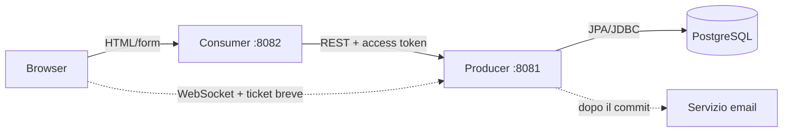
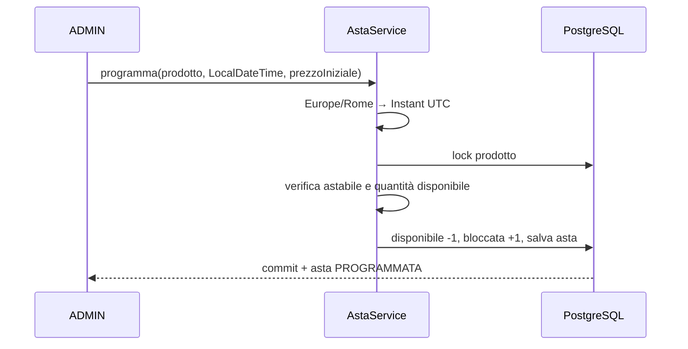
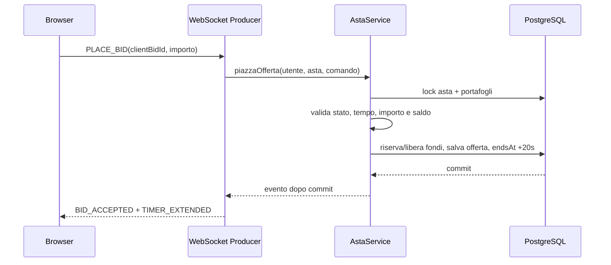

# Architettura e comunicazione

## Vista generale



La Consumer rende Thymeleaf e mantiene access token e refresh token nella
sessione server-side. Il browser invia le credenziali alla Consumer, che chiama
`POST /auth/login` sul Producer. Per ogni chiamata protetta la Consumer invia
`Authorization: Bearer <accessToken>`; alla scadenza usa `POST /auth/refresh` e
sostituisce entrambi i token nella sessione. Al logout chiama
`POST /auth/logout` e svuota la sessione. La Consumer protegge le rotte MVC
tramite lo stato di sessione e usa CSRF per i form; il Producer resta l'autorità
finale per ogni operazione protetta.
Per entrare in una stanza richiede al Producer un ticket WebSocket monouso,
valido 30 secondi. Il token principale non viene esposto al JavaScript.

## Producer

```text
it.esercitazione.liveauction.producer/
├── auth/          utenti, login e ticket WebSocket
├── prodotto/      catalogo, stock e flag astabile
├── inventario/    prodotti assegnati agli utenti
├── portafoglio/   saldo, riserve e ledger
├── asta/          programmazione, offerte e settlement
├── notifica/      email post-vittoria
├── websocket/     endpoint STOMP ed eventi stanza
└── common/        errori, auditing e configurazione
```

Il Producer richiede gli starter Security, WebSocket e Mail oltre a JPA,
Validation, PostgreSQL e Flyway.

## Consumer

```text
it.esercitazione.liveauction.consumer/
├── auth/          login web e sessione
├── client/        client REST verso il Producer
├── web/           controller MVC utente e ADMIN
├── dto/           modelli del contratto
└── config/        sicurezza web e client HTTP
```

Il JavaScript della stanza gestisce presentazione, countdown, riconnessione e
comandi STOMP. Non decide mai apertura, validità, vincitore o saldo.

## Programmazione e stock



## Attivazione temporale

Il ciclo previsto verifica gli istanti UTC; `AstaScheduler` implementa i primi
due passaggi, mentre il terzo appartiene al modulo di chiusura ancora da sviluppare:

1. a `startsAt - 3 minuti` porta l'asta in `STANZA_APERTA`;
2. a `startsAt` la porta in `APERTA` e fissa `endsAt = startsAt + 7 minuti`;
3. a `endsAt` la chiude, salvo estensioni di venti secondi già registrate.

Lo scheduler controlla le aste ogni secondo e recupera le transizioni
arretrate all'avvio, sotto lock e nella transazione dell'asta. Gli snapshot
REST sono letture: non modificano stato o stock. `offerteConsentite` verifica
anche la finestra temporale, quindi è falso per un'asta scaduta ancora
`APERTA`. I futuri comandi di offerta e chiusura dovranno ricontrollare stato
e scadenza sotto lock, senza affidarsi ai soli aggiornamenti periodici.

Nelle API e negli eventi implementati i campi temporali si chiamano `inizioAt`
e `fineAt`; `startsAt` ed `endsAt` nei diagrammi indicano gli stessi concetti.

## Flusso offerta



## Chiusura

La chiusura usa lock su asta, prodotto, inventario e portafogli e verifica di
nuovo stato e `endsAt`. Il trasferimento è idempotente. Dopo il commit vengono
pubblicati `AUCTION_CLOSED` e la richiesta di email; un problema email non
esegue rollback della vittoria.

## WebSocket e resilienza

- Protocollo STOMP su endpoint `/ws`.
- Join rifiutato prima dell'apertura della stanza.
- Nel pre-live sono permessi join e presenza, non le offerte.
- Topic pubblico per asta e coda privata per rifiuti e conferme sensibili.
- Heartbeat client/server ogni 10 secondi.
- Nessun tick al secondo dal server: il browser interpola il timer.
- Snapshot REST al primo ingresso, alla riconnessione e in caso di gap di
  `sequence`.

## Docker

Il profilo Compose `prod` mantiene l'ordine:

```text
PostgreSQL healthy → Producer healthy → Consumer healthy
```

Nel network Docker gli URL sono `postgres:5432` e `producer:8081`; dall'host le
porte rimangono 5432, 8081 e 8082, configurabili da `.env`.
