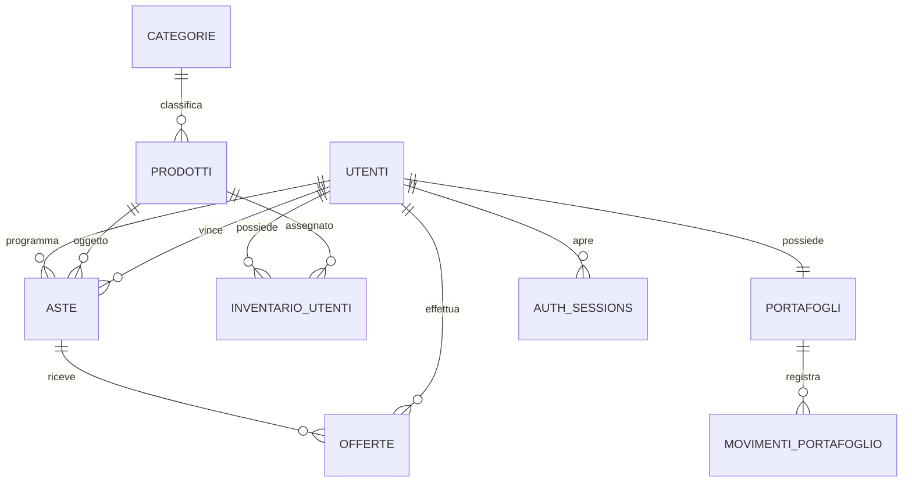

# Modello dati PostgreSQL

## Risposta rapida: come riconoscere un prodotto astabile

La decisione è memorizzata direttamente in `prodotti.astabile`:

```sql
SELECT id, nome, astabile, quantita_disponibile, quantita_bloccata
FROM prodotti;
```

Un prodotto può essere selezionato per una nuova asta soltanto quando
`astabile = TRUE` e `quantita_disponibile > 0`.

## Relazioni



## Tabelle delle aste

`auth_sessions` memorizza le sessioni di autenticazione: ID UUID, utente,
hash SHA-256 del refresh token, scadenza e data di revoca. È creata dalla
migrazione V9; i refresh token in chiaro non vengono salvati nel database.
La cancellazione dell'account conserva `utenti.id` per le relazioni storiche,
imposta `attivo = FALSE` e sostituisce username, email e hash della password.

Sono necessarie due tabelle:

- `aste`: una riga per evento programmato, con prodotto, ADMIN, prezzo
  iniziale, orari, stato e risultato finale;
- `offerte`: una riga immutabile per ciascun rilancio accettato.

La migrazione V10 aggiunge a `offerte` lo stato operativo `leader` e
`ritirata_at`: importo, offerente, UUID e data originali restano conservati.
Un indice parziale ammette al massimo un leader per asta; un'offerta ritirata
non può essere leader. Il prezzo finale rimane in `aste.offerta_corrente`,
mentre `vincitore_id` viene valorizzato solo alla chiusura.

La presenza live non richiede una tabella: per la prima versione è uno stato
effimero gestito dal WebSocket. Gli storici si ricavano da `aste.vincitore_id` e
dalle relative `offerte`.

## DDL di riferimento

### Coda email (V11, branch web_socket)

`notifiche_email` conserva una richiesta per asta: `asta_id` è PK e FK verso
`aste` (ON DELETE CASCADE). Campi: `stato` (PENDING/SENT/SKIPPED), `tentativi`,
`prossimo_tentativo_at`, `inviata_at`, `ultimo_errore` (codice generico),
`data_creazione`. Tutti gli istanti sono TIMESTAMPTZ UTC. Un indice parziale
seleziona le richieste PENDING. Non contiene copie di indirizzi email o messaggi.
Le migrazioni V1–V10 non vengono modificate. Dettagli in
[Notifiche email](10-notifiche-email.md).

### Tabelle di dominio

```sql
CREATE TABLE utenti (
    id BIGINT GENERATED BY DEFAULT AS IDENTITY PRIMARY KEY,
    username VARCHAR(50) NOT NULL UNIQUE,
    email VARCHAR(200) NOT NULL UNIQUE,
    password_hash VARCHAR(100) NOT NULL,
    ruolo VARCHAR(20) NOT NULL DEFAULT 'USER'
        CHECK (ruolo IN ('USER', 'ADMIN')),
    attivo BOOLEAN NOT NULL DEFAULT TRUE,
    data_creazione TIMESTAMPTZ NOT NULL DEFAULT CURRENT_TIMESTAMP
);

CREATE TABLE portafogli (
    id BIGINT GENERATED BY DEFAULT AS IDENTITY PRIMARY KEY,
    utente_id BIGINT NOT NULL UNIQUE REFERENCES utenti(id),
    saldo_totale NUMERIC(12,2) NOT NULL DEFAULT 0,
    saldo_riservato NUMERIC(12,2) NOT NULL DEFAULT 0,
    versione BIGINT NOT NULL DEFAULT 0,
    data_modifica TIMESTAMPTZ NOT NULL DEFAULT CURRENT_TIMESTAMP,
    CHECK (saldo_totale >= 0),
    CHECK (saldo_riservato >= 0),
    CHECK (saldo_riservato <= saldo_totale)
);

CREATE TABLE categorie (
    id BIGINT GENERATED BY DEFAULT AS IDENTITY PRIMARY KEY,
    nome VARCHAR(100) NOT NULL UNIQUE,
    slug VARCHAR(100) NOT NULL UNIQUE,
    attiva BOOLEAN NOT NULL DEFAULT TRUE
);

CREATE TABLE prodotti (
    id BIGINT GENERATED BY DEFAULT AS IDENTITY PRIMARY KEY,
    categoria_id BIGINT NOT NULL REFERENCES categorie(id),
    sku VARCHAR(30) NOT NULL UNIQUE,
    nome VARCHAR(200) NOT NULL,
    descrizione TEXT,
    prezzo_fisso NUMERIC(12,2),
    astabile BOOLEAN NOT NULL DEFAULT FALSE,
    quantita_disponibile INT NOT NULL DEFAULT 0,
    quantita_bloccata INT NOT NULL DEFAULT 0,
    attivo BOOLEAN NOT NULL DEFAULT TRUE,
    versione BIGINT NOT NULL DEFAULT 0,
    data_creazione TIMESTAMPTZ NOT NULL DEFAULT CURRENT_TIMESTAMP,
    CHECK (prezzo_fisso IS NULL OR prezzo_fisso > 0),
    CHECK (quantita_disponibile >= 0),
    CHECK (quantita_bloccata >= 0)
);

CREATE TABLE inventario_utenti (
    id BIGINT GENERATED BY DEFAULT AS IDENTITY PRIMARY KEY,
    utente_id BIGINT NOT NULL REFERENCES utenti(id),
    prodotto_id BIGINT NOT NULL REFERENCES prodotti(id),
    quantita INT NOT NULL DEFAULT 0 CHECK (quantita >= 0),
    versione BIGINT NOT NULL DEFAULT 0,
    UNIQUE (utente_id, prodotto_id)
);

CREATE TABLE aste (
    id BIGINT GENERATED BY DEFAULT AS IDENTITY PRIMARY KEY,
    prodotto_id BIGINT NOT NULL REFERENCES prodotti(id),
    admin_id BIGINT NOT NULL REFERENCES utenti(id),
    vincitore_id BIGINT REFERENCES utenti(id),
    stato VARCHAR(20) NOT NULL DEFAULT 'PROGRAMMATA'
        CHECK (stato IN (
            'PROGRAMMATA', 'STANZA_APERTA', 'APERTA', 'CHIUSA', 'ANNULLATA'
        )),
    prezzo_iniziale NUMERIC(12,2) NOT NULL CHECK (prezzo_iniziale > 0),
    incremento_minimo NUMERIC(12,2) NOT NULL DEFAULT 1.00
        CHECK (incremento_minimo > 0),
    offerta_corrente NUMERIC(12,2),
    inizio_at TIMESTAMPTZ NOT NULL,
    fine_at TIMESTAMPTZ NOT NULL,
    chiusa_at TIMESTAMPTZ,
    sequence BIGINT NOT NULL DEFAULT 0,
    versione BIGINT NOT NULL DEFAULT 0,
    data_creazione TIMESTAMPTZ NOT NULL DEFAULT CURRENT_TIMESTAMP,
    CHECK (fine_at >= inizio_at + INTERVAL '7 minutes')
);

CREATE TABLE offerte (
    id BIGINT GENERATED BY DEFAULT AS IDENTITY PRIMARY KEY,
    asta_id BIGINT NOT NULL REFERENCES aste(id),
    offerente_id BIGINT NOT NULL REFERENCES utenti(id),
    client_bid_id UUID NOT NULL UNIQUE,
    importo NUMERIC(12,2) NOT NULL CHECK (importo > 0),
    data_offerta TIMESTAMPTZ NOT NULL DEFAULT CURRENT_TIMESTAMP
);

CREATE TABLE movimenti_portafoglio (
    id BIGINT GENERATED BY DEFAULT AS IDENTITY PRIMARY KEY,
    portafoglio_id BIGINT NOT NULL REFERENCES portafogli(id),
    asta_id BIGINT REFERENCES aste(id),
    tipo VARCHAR(30) NOT NULL CHECK (tipo IN (
        'IMPOSTAZIONE_SALDO', 'RISERVA_OFFERTA', 'RILASCIO_OFFERTA',
        'PAGAMENTO_ASTA', 'INCASSO_ASTA', 'ACQUISTO_FISSO'
    )),
    importo NUMERIC(12,2) NOT NULL CHECK (importo > 0),
    saldo_totale_dopo NUMERIC(12,2) NOT NULL,
    saldo_riservato_dopo NUMERIC(12,2) NOT NULL,
    data_movimento TIMESTAMPTZ NOT NULL DEFAULT CURRENT_TIMESTAMP
);

CREATE INDEX idx_aste_stato_inizio ON aste(stato, inizio_at);
CREATE INDEX idx_aste_stato_fine ON aste(stato, fine_at);
CREATE INDEX idx_aste_prodotto ON aste(prodotto_id);
CREATE INDEX idx_aste_vincitore ON aste(vincitore_id, chiusa_at DESC);
CREATE INDEX idx_offerte_asta_data ON offerte(asta_id, data_offerta DESC);
CREATE INDEX idx_movimenti_wallet_data
    ON movimenti_portafoglio(portafoglio_id, data_movimento DESC);
```

## Coerenza dello stock

La modifica ADMIN del prodotto richiede la `versione` letta dal client.
Un aggiornamento concorrente o una versione obsoleta restituisce
`409 VERSIONE_NON_AGGIORNATA`. Ogni modulo che aggiorna lo stock, anche tramite
SQL, deve incrementare `prodotti.versione` nella stessa transazione, affinché
il controllo ottimistico JPA impedisca di sovrascrivere quantità cambiate.
`quantita_bloccata` non è un campo di input della modifica ADMIN.

La visibilità pubblica richiede sia `prodotti.attivo` sia `categorie.attiva`;
la disattivazione della categoria non aggiorna né elimina le righe prodotto.

La programmazione deve bloccare la riga `prodotti` con lock pessimista, verificare
il flag e decrementare la quantità disponibile nella stessa transazione che crea
`aste`. Il campo `versione` aggiunge protezione da aggiornamenti concorrenti.

La quantità totale fisica di catalogo si ricava come:

```text
quantita_disponibile + quantita_bloccata + unità assegnate agli inventari
```

## Date e fuso orario

`inizio_at`, `fine_at` e `chiusa_at` sono `TIMESTAMPTZ`. L'input HTML
`datetime-local` viene interpretato esplicitamente in `Europe/Rome` e convertito
in UTC prima della persistenza. Le API restituiscono date ISO 8601 con offset UTC.

Le migrazioni Flyway creano soltanto le tabelle e gli indici, una tabella per
file. Utenti, prodotti e aste vanno creati esplicitamente dopo l'avvio.
